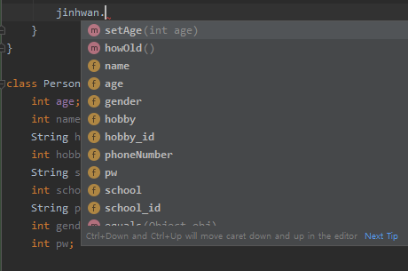

# Java 접근제어자


## **접근제어자(public, private, protected)**

### 접근제어자(Access Modifier)란?


접근제어자란 변수, 메소드, 클래스 선언시 사용되며 해당 변수, 메소드, 클래스의 접근을 제한하는 역할을 한다.

접근제어자를 사용하는 이유는 선언된 데이터를 외부로부터 보호해주기 위한 것으로 객체지향 프로그래밍의 특성인

캡슐화(Encapsulation)와 정보은닉을 구현하게 해준다.


접근제어자는 생략이 가능하며, 생략시 default를 뜻한다.


접근제어자의 종류는 default와 함께 3가지가 있다.


- 접근제어자

  

- | Modifier  | 설명                                                       |
  | --------- | ---------------------------------------------------------- |
  | public    | 모든 접근이 가능, 제한이 없다                              |
  | private   | 동일한 클래스 내에서만 접근 가능                           |
  | protected | 동일패키지에 속하는 클래스와 하위클래스 관계에서 접근 가능 |


- 접근 권한

  

- | 종류      | 클래스 | 패키지 | 하위클래스 | 전체 |
  | --------- | ------ | ------ | ---------- | ---- |
  | public    | O      | O      | O          | O    |
  | protected | O      | O      | O          | X    |
  | default   | O      | O      | X          | X    |
  | private   | O      | X      | X          | X    |

---

**심화**

### OOP/ Setter와 Getter

#### **자바의 접근 제한자**

```
private : 같은 클래스 내에서만 접근 가능

default : 같은 패키지 내에서만 접근 가능

protected : 같은 패키지내 또는 자손 클래스일 경우 접근 가능

public : 제한 없음
```

 

#### **캡슐화**

접근 제한자는 객체지향의 캡슐화, 그리고 그를 통한 코드 은닉화를 위한 도구이다. 데이터를 외부로부터 숨기거나, 접근을 막고, 또는 접근에 처리를 강제화한다.

 

이전에 oop 캡슐화에 대해서 정리한 글이 있다. 객체지향을 공부하면서 캡슐화를 정확히 몰랐고, 은닉화와 구분하지 못해서 정리했던 기억이 난다. 그때 캡슐성을 아래 3개로 정리했다.

```
Encapsulation

1) 유사한 기능이나 변수를 한 집합으로 하여 더 관리하기 쉽게하고 코드를 명확히 함.

2) 외부에서 멤버를 엑세스하는 방법을 지정할 수 있도록, 직접 접근을 막거나 접근 전 부가적인 처리를 요구함.

3) 정보를 외부에 은닉하여 외부에서는 해당 집합의 세부 내용에 집중하지 않도록 함
```

 1번은 클래스나 구조체처럼, 객체의 속성이나 행위를 집합화하는 것을 말한다.

 

 2번과 3번은 접근 제한자, 특히 'Getter / Setter의 사용 이유'와 '은닉성'을 각각 설명하고 싶었다.

 

 

#### **Setter**

getter와 setter를 처음 접했을 때 왜 굳이 변수를 private으로 하고, 다른 메소드를 통해 제어하는지 이해가 전혀 되지 않았다. 아마 처음 c#이나 java를 접한 사람들도 그럴 것 같다.

 

아래 코드에서 jinhwan이라는 사람의 나이에 -1이 대입되었다.

 

쉽게 보기 위해 main에서 직접 대입했지만, 더 복잡한 코드에서 다른 메소드에 의해 값이 변경되고, 이상한 값이 age에 들어오면 문제를 파악하기 쉽지 않을 것이다.

```
class Application{
    public static void main(String[] args){
        Person jinhwan = new Person();
        jinhwan.age = -1;
        jinhwan.howOld();
    }
}

class Person{
    int age;

    void howOld(){
        System.out.println(age);
    }
}
```

 

이번에는 age를 private으로 해서 직접 값 할당을 못하게 제한하고, 메소드를 이용해서 age에 -1을 대입했다. 단, 이때는 나이는 음수가 될 수 없으므로 음수가 입력되면 0을 대입하도록 하여 나이에 음수가 대입되는 상황을 처리하였다.

 

이런식으로 잘못된 입력에 기본 값을 대입하거나, 에러를 출력하고 시스템이 종료되게 하는 것으로 문제를 확인하는 처리가 대표적이다. 

```
class Application{
    public static void main(String[] args){
        Person jinhwan = new Person();
        jinhwan.setAge(-1);
        jinhwan.howOld();
    }
}

class Person{
    private int age;

    public void setAge(int age) {
        if(age >=0){
            this.age = age;
        }
        else
            this.age = 0;
    }
    
    void howOld(){
        System.out.println(age);
    }
}
```

setter는 이렇게 변수의 값 대입이 여러 곳에서, 제한 없이 가능한 것을 접근 제한자로 막고, 접근 범위에 한해서 메소드로 대입전 값을 처리 후 대입되게 하기 위해 사용된다.

 

이때 setter는 set+'Variablename'으로 이름 짓는 것이 보편적이다.

 

 

#### **Getter / 은닉성**

메소드를 통해 값을 대입하는 것은 대입전 사전 처리가 필요하니 그럴 수 있다고 치자. Getter는 왜 쓰는 걸까. 어차피 그 값에 영향을 미치지 않으면 값을 가져오는거야 자유롭게 하면 안될까?

 

큰 프로젝트에서 엄청 긴 코드를 다룬다고 생각해보자. 다른 사람의 코드 속 모든 변수 값을 가져올 필요도 없을 뿐더러, 가져올 수 있는 것이 마냥 편한 일은 아닐 것이다.

 

자동차 게임을 개발하는 상황을 가정해보자. 만약 당신이 자동차가 충돌 시 튕겨나가는 이벤트 처리를 만드는 일을 담당한다면, 충돌하는 자동차의 색상이나, 브랜드를 알야할까? 아마 불필요한 정보에 신경이 빼앗길 것이다.

```
class Application{
    public static void main(String[] args){
        Person jinhwan = new Person();
    }
}

class Person{
    int age;
    int name;
    String hobby;
    int hobby_id;
    String school;
    int school_id;
    String phoneNumber;
    int gender;
    int pw;
}
```

자동차 객체를 가져다 쓸 때 차종, 색, 휠, 차량 넘버, 제조사 등의 잡다한 정보는 자동차를 구현한 사람들의 몫이고, 다른 사람에게 방해만 될 뿐이다.

 

위 코드에서 age와 name을 제외하곤, 다른 사람에게 불필요한 정보이다. 

 


 인텔리전스의 제안만 더럽히는 불필요한 정보들.  


```
class Person{
    private int age;
    private int name;
    
    private String hobby;
    private int hobby_id;
    private String school;
    private int school_id;
    private String phoneNumber;
    private int gender;
    private int pw;

    public int getAge() {
        return age;
    }

    public int getName() {
        return name;
    }

    public void setAge(int age) {
        if(age >=0){
            this.age = age;
        }
        else
            this.age = 0;
    }
}
```

 

이번에는 변수의 접근을 private처리해서 해당 클래스 안에서만 노출되게 바꾸고, 다른 사람들도 사용할 필요가 있는 주요 변수 age, name만 getter을 이용해서 드러냈다. 

 

이렇게 변수들의 외부 노출을 제한하고, 노출 범위를 정해주는 것이 Getter고, 그러한 속성이 은닉성이다.