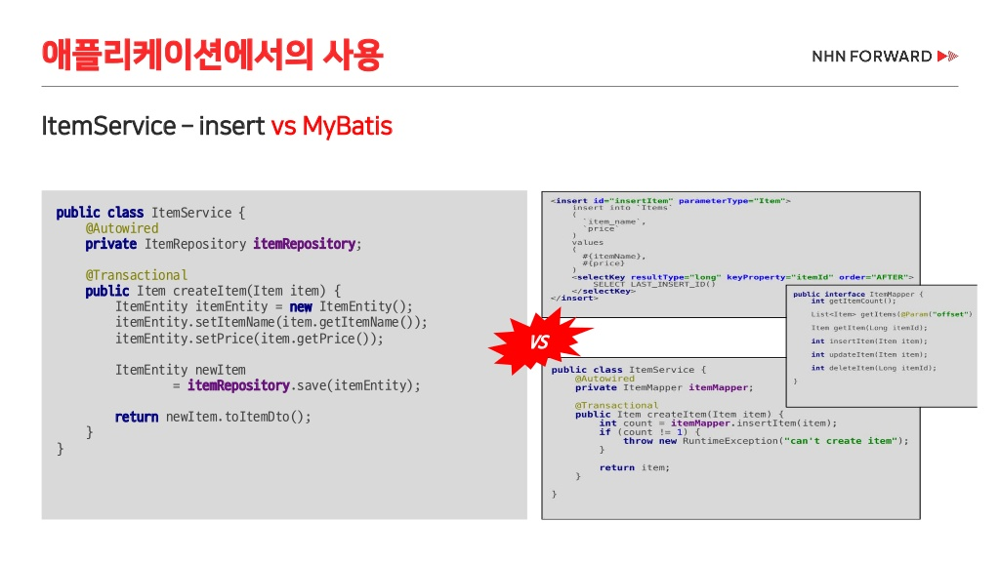

# # MyBatis vs JPA 차이

[TOC]

#### **JPA (Java Persistence API)**

\- 자바 ORM의 기술 표준, 대표적인 오픈 소스가 Hibernate이다.

#### **ORM(Object-relational mapping)**

\- 객체 관계 매핑, 객체와 RDB를 별개로 설계하고 ORM이 중간에서 매핑해주는 역할

즉, ORM은 SQL문이 아닌 RDB에 데이터 그 자체와 매핑하기 때문에 SQL을 직접 작성할 필요가 없다.

해당 객체와의 매핑에 필요한 SQL문을 알아서 만들어준다.

이로인해 어떤 RDB를 사용하던 상관 없다.

SQL문이 아닌 ORM에서 제공하는 메서드, 코드 등을 이용하기에 직관적이다.

#### **MyBatis (Java Persistence Framework)**

\- 마이바티스는 개발자가 지정한 SQL, 저장프로시저 그리고 몇가지 고급 매핑을 지원하는 퍼시스턴스 프레임워크이다. 마이바티스는 JDBC로 처리하는 상당부분의 코드와 파라미터 설정및 결과 매핑을 대신해준다. 마이바티스는 데이터베이스 레코드에 원시타입과 Map 인터페이스 그리고 자바 POJO 를 설정해서 매핑하기 위해 XML과 애노테이션을 사용할 수 있다. ( MyBatis 공식 홈페이지 소개 )

MyBatis는 자바에서 SQL Mapper를 지원해주는 Framework이다.

즉, SQL 작성을 직접 하여 객체와 매핑시켜준다.

추가: 프로시저(PL/SQL 같은 친구들), POJO(순수 자바코드, 즉 직접 만든 엔티티(class)), 원시타입(기본형)

#### **SQL Mapper**

\- SQL문을 이용하여 RDB에 접근, 데이터를 오브젝트(객체)화 시켜준다.

개발자가 작성한 SQL문으로 해당되는 ROW를 읽어 온 후 결과 값을 오브젝트화 시켜 사용가능하게 만들어준다.

즉, RDB에 따라 SQL 문법이 다르기 때문에 특정 RDB에 종속적이다.

---

> `JDBC`: **JDBC**(Java Database Connectivity)는 자바에서 데이터베이스에 접속할 수 있도록 하는 자바 API이다.

# Mybatis 와 JPA

- Mybatis 특징
- JPA 특징

## Mybatis

`JDBC` 를 좀더 편하게 사용할 수 있도록 객체를 SQL 이나 저장 프로시저와 매핑 해주는 퍼시스턴스 프레임워크 SQL 구문을 java 메소드와 매핑해준다.

### 장점

- 다른 프레임워크에 비해 간단하다.
- 소스 코드와 SQL 의 분리 (생산성, DBA와의 협업)
- SQL을 직접 다뤄 복잡한 쿼리 작성, SQL 함수나 저장 프로시저를 자유롭게 이용가능

### 단점

- 반복적인 코드와 CRUD SQL 작업
- SQL과 데이터베이스 벤더에 대한 종속성(오라클에서 mySQL 로 바꾸면 함수들을 바꿔줘야한다.)

## ORM(JPA)

자바 객체를 데이터테이블과 매핑시킨다.
`ORM` : 데이터베이스 객체를 자바 객체로 매핑하여 객체 간의 관계를 바탕으로 SQL을 자동으로 생성
`JPA` : 자바 진영의 ORM 표준 기술

### 장점

- 생산성 CRUD 같은 간단한 쿼리는 자동으로 된다.
- entity 에 추가 속성이 생기면 Mybatis 의 경우 쿼리에 각각 다 추가해줘야하지만 JPA는 Entity에 속성만 추가 시켜주면 된다.
- 데이터 접근 추상화 벤더 독립성
- SQL 중심적인 개발에서 객체 중심으로 개발가능

### 단점

- 상대적으로 높은 학습 곡선

- 복잡한 쿼리작성의

   

  어려움

  - JPQL을 통해 해결가능
  - Native SQL로 직접 작성가능
  - mybatis 와 혼용가능

## 결론

JPA를 사용하면 mybatis 를 사용할 때 보다 아래 그림과 같이 중복을 제거할 수 있다.

그리고 더 나은 객체지향적 설계가 가능하다.
하지만 학습비용이 높다. 그러므로 아직은 mybatis와 JPA를 혼용 하면서 좀더 나은 코드로 발전시키면 될 것 같다.

## 참고

https://www.youtube.com/watch?v=XQZY0yN9gz0